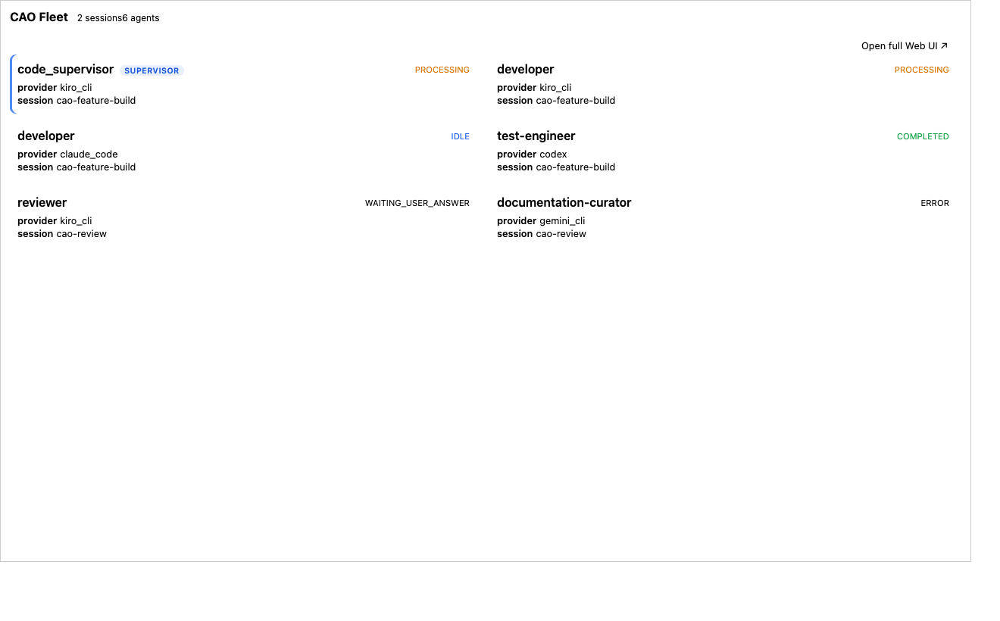
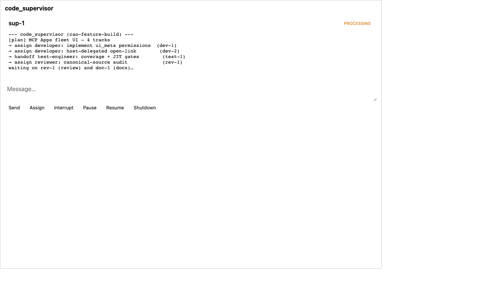
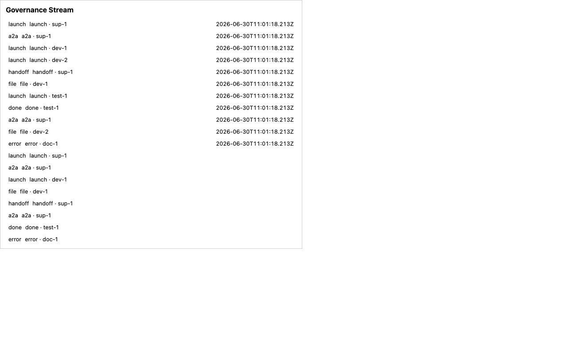

# MCP Apps — host-rendered fleet UI

CAO can expose a **sandboxed, host-rendered UI** (the
[MCP Apps](https://modelcontextprotocol.io/extensions/apps/overview) extension,
SEP-1865) so an operator can **observe and steer a CAO fleet from inside any
MCP App-capable host** — ChatGPT, Claude / Claude Desktop, VS Code (GitHub
Copilot), Microsoft 365 Copilot, Goose, Postman, MCPJam, Archestra.AI (see the
[client support matrix](https://modelcontextprotocol.io/extensions/client-matrix)
for the authoritative, up-to-date list). It
ships three single-file HTML views plus a lightweight topology widget, driven by
a small set of MCP tools and backed by an in-process event ring buffer.

The whole surface is **default-off and behavior-preserving**: with
`CAO_MCP_APPS_ENABLED` unset, nothing is registered and CAO behaves byte-for-byte
as it does today (localhost-only on `127.0.0.1:9889`).

## Demo

| Dashboard | Agent detail | Live event stream |
|---|---|---|
|  |  |  |

Full motion walk-through: [`media/mcp-apps-demo.webm`](media/mcp-apps-demo.webm)
(dashboard → agent detail → live event stream updating from pushed events).

These are captured by [`cao_mcp_apps/scripts/record-demo.mjs`](../cao_mcp_apps/scripts/record-demo.mjs):
it boots the e2e host harness (`e2e/server.mjs`) — which serves the **real built
view bundles** inside an MCP-host iframe with live host data over the same
postMessage/SSE contract a host uses — drives an operator flow, and records it.
Regenerate with `cd cao_mcp_apps && npm run build:all && node scripts/record-demo.mjs`
(the recorder also emits an optimized `mcp-apps-demo.gif` when a gif-capable
ffmpeg/gifski is on the machine). A true in-host render (Claude Desktop / Cursor /
Goose) can't be captured headlessly, so this harness is a faithful stand-in.

## Enabling

```bash
export CAO_MCP_APPS_ENABLED=true   # default: false
uv run cao-server                  # FastAPI + /events on :9889
uv run cao-mcp-server              # registers the MCP App tools/resources
```

The surface is packaged as the built-in **`mcp_apps` plugin** (discovered via the
`cao.plugins` entry-point group). On MCP server startup the plugin's
`on_mcp_server` hook registers the tools, the `ui://cao/*` resources, the topology
widget, and the capability advertisement — all best-effort, so an older FastMCP
build or a missing frontend build degrades gracefully (logged, never fatal).

## Surfaces

| Surface | URI | What it shows |
|---|---|---|
| Dashboard | `ui://cao/dashboard` | Sessions, terminals, provider status, fleet overview; the mutation entry point. |
| Agent detail | `ui://cao/agent` | One terminal: status, recent output tail, inbox depth, sub-agents. |
| Event stream | `ui://cao/event-stream` | Compact, app-only governance ticker of normalized fleet events. |
| Topology widget | `cao://widget/topology` | Vanilla-JS live event view; also served at `/widgets/topology/` as a build-free fallback for hosts/older clients that don't render the full React views. |

## MCP tools (`mcp_server/app_tools.py`)

- `render_dashboard` / `render_agent_view` — return a snapshot the host renders in
  the matching `ui://cao/*` view.
- `cao_fetch_history` — replays normalized events from the ring buffer (app-only;
  used for iframe re-hydration after a re-mount).
- `subscribe_events` — returns the live SSE endpoint descriptor.
- `submit_command` — the **single mutation choke point**: classifies the command
  kind, applies a scope pre-check, and routes to a real Backplane HTTP endpoint.

Each rendering tool carries a `_meta.ui` annotation. The **spec-standard** tool
fields are `resourceUri` + `visibility`; the spec-standard *resource* fields are a
structured `csp`, `permissions`, `domain`, and `prefersBorder`, with MIME
`text/html;profile=mcp-app`, per the stable
[2026-01-26 spec](https://github.com/modelcontextprotocol/ext-apps/blob/main/specification/2026-01-26/apps.mdx)
(SEP-1865, Status: Stable). `preferredFrameSize` and `requiredScopes` are
**CAO-specific** additions to `_meta.ui`, not part of the spec schema — the spec
sizes views via the host's `containerDimensions` and the View's
`ui/notifications/size-changed` notification instead, and CAO declares **no
elevated `permissions`** (camera/microphone/geolocation/clipboard) by design.

## Architecture & data flow

```
lifecycle events ─▶ event_log_publisher (observer plugin)
                      │  normalize to 6 primitives
                      ▼
                 event_log_service (500-event / 24h ring buffer)
                      │
        ┌─────────────┴─────────────┐
        ▼                           ▼
   sse_bus (/events, drop-on-slow)   cao_fetch_history (/events/history)
        │                           │
        ▼                           ▼
   iframe live stream          iframe backfill on re-mount
        ▲
   render_dashboard / render_agent_view  ── snapshot + RFC-6902 JSON Patch deltas
        │
   submit_command ─▶ scope pre-check ─▶ Backplane mutation endpoint (HTTP-only)
```

- **Semantic vocabulary** (`services/event_primitives.py`): lifecycle events
  normalize to `{launch, handoff, a2a_delegation, file_mod, completion, error}`
  (plus `other`).
- **Snapshot + diff** (`services/ui_state_service.py`): pure projection + RFC-6902
  JSON Patch so the iframe applies incremental updates.
- **SSE fan-out** (`services/sse_bus.py`): a bounded per-subscriber queue;
  drop-on-slow so one stalled iframe never back-pressures the orchestrator.
  Cross-thread publishes are marshalled onto each subscriber's loop with
  `call_soon_threadsafe` (an `asyncio.Queue` is not thread-safe).

## Capability negotiation

When enabled, the server advertises the `io.modelcontextprotocol/ui` extension on
the `initialize` handshake so MCP App hosts discover the surface
(`ext_apps/sep2133.py`). The extension is negotiated through the standard MCP
[extensions capability mechanism](https://modelcontextprotocol.io/extensions/overview#negotiation)
(`capabilities.extensions["io.modelcontextprotocol/ui"]` carrying the REQUIRED
`mimeTypes: ["text/html;profile=mcp-app"]`); the installed MCP SDK exposes only
`experimental`, so CAO advertises there and `client_supports_mcp_apps` accepts
**either** location (forward-compatible). `negotiate_capabilities` offers the
pull-model equivalent.

## Security

- **HTTP-only boundary.** Every `mcp_server` module reaches state only through the
  FastAPI REST/SSE surface (no direct `clients.tmux` / `clients.database`
  imports); an AST guard test (`test/test_http_only_boundary.py`) enforces it.
- **Sandbox.** Views are JIT-free (no `eval` / `new Function`) so they run under a
  strict host CSP with `allowUnsafeEval:false`; a CI scan fails the build on
  violations.
- **Authorization (default-off).** A generic OAuth 2.1 / RFC 9728 layer
  (`security/auth.py`) maps tokens to the `{cao:read, cao:write, cao:admin}`
  taxonomy. With `AUTH0_DOMAIN` / `CAO_AUTH_JWKS_URI` unset, every path returns
  the full scope set and nothing is enforced. When enabled, mutating endpoints
  require `cao:write`/`cao:admin` and `delete_session` requires `cao:admin`
  (enforced via the `require_any_scope` dependency), and the read-only event
  endpoints (`/events`, `/events/history`) require at least `cao:read`.
  Token validation pins the **issuer** (`iss`, against the configured
  authorization server) and the **audience** (`aud`) in addition to the RS256
  signature and `exp` — audience falls back to the PRM resource id
  (`API_BASE_URL`) so it is never silently unverified when auth is on. See
  [Key decisions & deferred hardening](#key-decisions--deferred-hardening).
- **Event endpoints are part of the default-off surface.** `/events` and
  `/events/history` (and the observer that feeds them) expose fleet metadata
  (terminal ids, session names, routing/launch/kill topology). They return
  **404 unless `CAO_MCP_APPS_ENABLED` is set**, and the `event_log_publisher`
  observer no-ops while disabled — so a CAO with the surface off retains no
  fleet event history and exposes no event timeline.
- **Default posture.** With `CAO_MCP_APPS_ENABLED=true` but no IdP configured, the
  surface (including `submit_command` mutations) inherits CAO's unauthenticated,
  localhost-only trust model — keep it on a trusted loopback host and configure an
  IdP before exposing it more widely; the server logs a startup warning in this state.

## Configuration

| Variable | Default | Purpose |
|---|---|---|
| `CAO_MCP_APPS_ENABLED` | `false` | Master switch for the entire surface. |
| `CAO_MCP_APPS_STATIC_DIR` | — | Override the built `apps_static/` location. |
| `AUTH0_DOMAIN` / `CAO_AUTH_JWKS_URI` | — | Enable the auth layer (IdP). |
| `CAO_AUTH_AUDIENCE`, `CAO_AUTH_ISSUER` | — | Token audience / issuer for validation + PRM. |
| `CAO_AUTH_LOCAL_TOKEN` | — | Service token the MCP server forwards on its internal calls to the CAO API when auth is enabled (see H3 below). Required for auth-enabled mutation. |

### Auth-enabled mutation (`CAO_AUTH_LOCAL_TOKEN`)

When the auth layer is enabled (`AUTH0_DOMAIN` / `CAO_AUTH_JWKS_URI` set), the
MCP server reaches Backplane state over loopback HTTP to the FastAPI app, and
those mutation endpoints now *enforce* scope. The internal hop therefore needs a
credential: provision a **machine token** from the same IdP, scoped with the
permissions the surface needs (`cao:write` / `cao:admin`), and set it as
`CAO_AUTH_LOCAL_TOKEN`. The MCP server attaches it as
`Authorization: Bearer <token>` on its internal `submit_command` / read calls.

If auth is enabled but `CAO_AUTH_LOCAL_TOKEN` is unset, `submit_command` returns
a structured, actionable error (`{"success": false, "error": "auth enabled but
CAO_AUTH_LOCAL_TOKEN is not set: …"}`) rather than surfacing a raw `401`. With
auth disabled (the default) no header is attached and behavior is unchanged.

## Building the frontend

The three views are single-file HTML built from `cao_mcp_apps/`:

```bash
cd cao_mcp_apps && npm ci && npm run build:all   # emits src/.../ext_apps/apps_static/*.html
```

The built bundles (and the committed `ext_apps/static/` topology widget) ship in
the wheel via the `[tool.hatch.build].artifacts` force-include. If the bundles are
absent (dev tree without a build), resource registration degrades gracefully and
the topology widget still works (it needs no build step).

## Key decisions & deferred hardening

This surface landed via PR [#332](https://github.com/awslabs/cli-agent-orchestrator/pull/332).
A review pass (Copilot + a manual audit) drove the following decisions; they are
recorded here because they shape how the MCP Apps surface should evolve.

**Applied in this surface**

- **The whole surface is gated on `CAO_MCP_APPS_ENABLED`, end to end.** Beyond the
  tools/resources/widget, the `event_log_publisher` observer and the `/events`
  + `/events/history` HTTP endpoints are *also* gated, so "default-off" means
  *zero retention and zero exposure* of fleet metadata, not just "no UI". Any new
  surface (endpoint, plugin hook, background task) MUST honor this flag.
- **Auth, when enabled, verifies issuer and audience** (not just signature/expiry),
  with audience defaulting to the PRM resource id. New protected resources should
  reuse `security/auth.py` (`get_current_scopes` / `require_any_scope`) rather than
  re-deriving validation.
- **Reads require `cao:read`; mutations require `cao:write`/`cao:admin`.** Keep the
  taxonomy meaningful: gate every new MCP-Apps-reachable read on at least
  `cao:read` and every mutation on write/admin.
- **H3 — internal MCP→API auth (resolved).** When auth is enabled the MCP server
  forwards `CAO_AUTH_LOCAL_TOKEN` as a bearer on its loopback calls to the FastAPI
  mutation endpoints, so `submit_command` succeeds end to end; a missing local
  token yields a structured, actionable error instead of a raw `401`. See
  [Auth-enabled mutation](#auth-enabled-mutation-cao_auth_local_token).
- **H4 — complete scope coverage (resolved).** Every mutating route (flows,
  workflows, memory, terminal lifecycle, settings, profile install, run-step) now
  carries a `require_any_scope` dependency — `cao:write` for create/update/run and
  `cao:admin` for destructive deletes — so an auth-enabled `cao:read` token is
  `403`'d across the whole API. A route-coverage guard test
  (`test/api/test_scope_coverage.py`) fails if a future mutating route is added
  without a scope dependency.
- **JWKS robustness.** The JWKS cache forces a single refresh + retry on an
  unknown `kid` (key rotation no longer waits out the 1 h TTL), and bounds
  reuse-on-unreachable to a 24 h staleness cap so it fails closed rather than
  trusting indefinitely-stale keys.
- **Event-history input hardening.** `/events/history` clamps `limit` to
  `[0, RING_CAPACITY]` and validates each `kinds` token against the closed event
  vocabulary (unknown kinds → `400`).

## See also

- `examples/mcp-apps/` — a worked enable-and-drive example.
- `skills/cao-mcp-apps/SKILL.md` — operator playbook.
- **Authoritative spec & sources of truth:**
  - [MCP Apps — Overview](https://modelcontextprotocol.io/extensions/apps/overview) ·
    [Build an MCP App](https://modelcontextprotocol.io/extensions/apps/build)
  - [Extensions overview](https://modelcontextprotocol.io/extensions/overview) ·
    [capability negotiation](https://modelcontextprotocol.io/extensions/overview#negotiation) ·
    [client support matrix](https://modelcontextprotocol.io/extensions/client-matrix)
  - Stable spec **2026-01-26** (SEP-1865, Status: Stable):
    [`specification/2026-01-26/apps.mdx`](https://github.com/modelcontextprotocol/ext-apps/blob/main/specification/2026-01-26/apps.mdx)
  - SDK [`@modelcontextprotocol/ext-apps`](https://www.npmjs.com/package/@modelcontextprotocol/ext-apps)
    (v1.7.4) · [API reference](https://apps.extensions.modelcontextprotocol.io/api/index.html) ·
    [repo](https://github.com/modelcontextprotocol/ext-apps)
  - Provenance / discussion: [SEP-1865 PR #1865](https://github.com/modelcontextprotocol/modelcontextprotocol/pull/1865)
