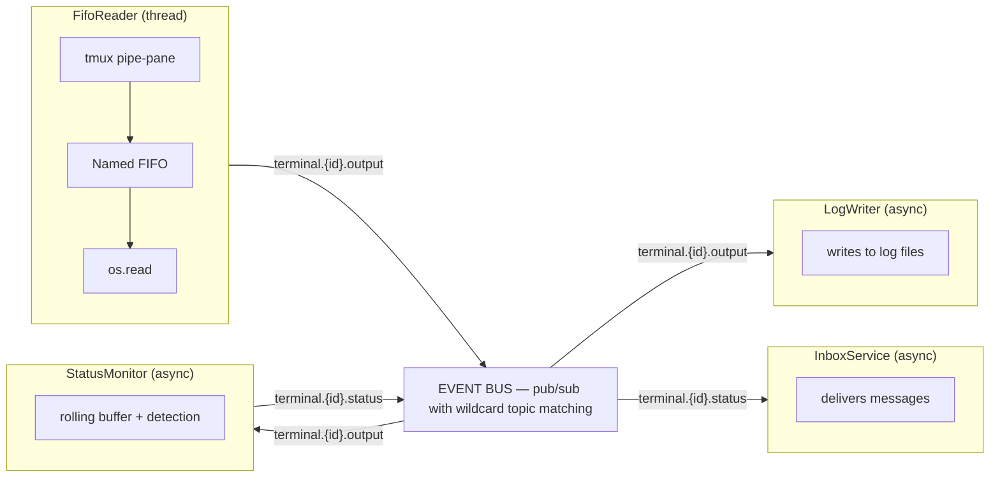

# 事件驱动架构

## 概述

CAO 在终端输出处理、状态检测和 inbox 消息投递方面采用事件驱动架构。终端输出流经一个由进程内 pub/sub 事件总线连接的组件流水线。

## 架构

```
┌───────────────────┐  publish    ┌──────────────────────────┐  subscribe  ┌─────────────┐
│ FifoReader        │────────────▶│        EVENT BUS         │────────────▶│ LogWriter   │
│ (thread)          │  terminal.  │                          │  terminal.  │ (async)     │
│                   │  {id}.      │  pub/sub with wildcard   │  {id}.      │             │
│ tmux pipe-pane    │  output     │  topic matching          │  output     │ writes to   │
│  ▼ Named FIFO     │             │                          │             │ log files   │
│  ▼ os.read()      │             │                          │             └─────────────┘
└───────────────────┘             │                          │
                                  │                          │  subscribe  ┌───────────────┐
                                  │                          │────────────▶│ StatusMonitor │
                                  │                          │  terminal.  │ (async)       │
                                  │                          │  {id}.      │               │
                                  │                          │  output     │ rolling buffer│
                                  │                          │             │ + detection   │
                                  │                          │◀────────────│               │
                                  │                          │  publish    └───────────────┘
                                  │                          │  terminal.
                                  │                          │  {id}.
                                  │                          │  status
                                  │                          │
                                  │                          │  subscribe  ┌─────────────┐
                                  │                          │────────────▶│InboxService │
                                  │                          │  terminal.  │ (async)     │
                                  │                          │  {id}.      │             │
                                  │                          │  status     │ delivers    │
                                  └──────────────────────────┘             │ messages    │
                                                                           └─────────────┘
```



所有服务间通信都流经事件总线。没有任何服务为了事件处理而直接调用另一个服务——总线是唯一的代理机制。

## 事件总线(`services/event_bus.py`)

事件总线是连接所有发布者和消费者的**中央代理机制**。它实现了一个进程内 pub/sub 路由器,具备通配符 topic 匹配、线程安全的发布,以及通过 `asyncio.Queue` 进行的异步消费。

流水线中的每个组件都只通过事件总线通信——发布者从不直接调用消费者。这解耦了各个组件,允许在不修改发布者的情况下添加新的消费者,并确保系统中的数据流向清晰。

**Topic:**

| Topic | 发布者 | 消费者 |
|-------|----------|-----------|
| `terminal.{id}.output` | FifoReader | StatusMonitor, LogWriter |
| `terminal.{id}.status` | StatusMonitor | InboxService |

**订阅模式:**

- 精确匹配:`terminal.abc12345.output`
- 通配符:`terminal.*.output`(匹配任意 terminal ID)

**线程安全:** 发布者可从任意线程调用 `bus.publish()`。事件总线使用 `loop.call_soon_threadsafe()` 将事件派发到启动时通过 `bus.set_loop()` 注册的 asyncio 事件循环中。

## 组件角色

每个服务都有明确定义的角色:作为**发布者**、**消费者**或**两者兼有**:

| 组件 | 角色 | 订阅 | 发布到 |
|-----------|------|---------------|--------------|
| **FifoReader** | 仅发布者 | —(从 OS FIFO 读取) | `terminal.{id}.output` |
| **StatusMonitor** | 发布者 + 消费者 | `terminal.*.output` | `terminal.{id}.status` |
| **LogWriter** | 仅消费者 | `terminal.*.output` | — |
| **InboxService** | 仅消费者 | `terminal.*.status` | —(通过 `send_input` 投递) |

- **纯发布者**(FifoReader)是向总线注入事件的数据源。
- **纯消费者**(LogWriter、InboxService)对事件作出响应并执行副作用(写日志、投递消息)。
- **发布者 + 消费者**(StatusMonitor)对事件进行转换:它消费原始输出,推导出状态,并为下游消费者发布状态变更事件。

> **Warning: Threading and event loop discipline.** 发布者和消费者的实现在管理线程时必须格外小心。FifoReader 运行在一个专用的 OS 线程中(对 FIFO 进行阻塞式 `os.read`),并通过 `call_soon_threadsafe` 发布到 asyncio 循环。所有消费者(`StatusMonitor`、`LogWriter`、`InboxService`)作为 asyncio 任务运行在主事件循环上。消费者的 `run()` 方法必须**始终让出控制权回到事件循环**(通过 `await queue.get()`),并避免长时间运行的同步操作,否则会阻塞其他消费者处理事件。如果消费者需要执行阻塞式 I/O,应通过 `asyncio.to_thread()` 将其卸载到线程池。

## 组件

### FIFO Reader(`services/fifo_reader.py`)—— 发布者

为每个终端创建一个命名管道(FIFO)并启动一个守护读取线程。tmux 的 `pipe-pane` 将终端输出写入 FIFO;读取线程读取 4KB 数据块并发布 `terminal.{id}.output` 事件。

### Status Monitor(`services/status_monitor.py`)—— 发布者 + 消费者

订阅 `terminal.*.output`。为每个终端将输出累积到一个滚动缓冲区(8KB)中,通过已注册的 provider 检测状态(在该终端注册 provider 之前返回 `UNKNOWN`),并在状态变化时发布 `terminal.{id}.status`。它也是当前终端状态的事实来源。

### Log Writer(`services/log_writer.py`)—— 消费者

订阅 `terminal.*.output`。将数据块追加到每个终端的日志文件(`~/.cao/logs/terminal/{id}.log`)中,用于调试。

### Inbox Service(`services/inbox_service.py`)—— 消费者

订阅 `terminal.*.status`。当状态为 IDLE 或 COMPLETED 时,通过 `send_input` 将最早的待处理 inbox 消息投递到终端,并更新数据库中的消息状态。

## 启动与关闭

在服务器启动期间(`api/main.py` lifespan):

1. 向事件总线注册 asyncio 事件循环:`bus.set_loop(loop)`
2. 启动消费者任务:`StatusMonitor.run()`、`LogWriter.run()`、`InboxService.run()`

在关闭期间:

1. 取消所有消费者任务
2. 使用 `asyncio.gather()` 配合 `return_exceptions=True` 等待干净退出

FIFO reader 由 `terminal_service` 在创建/删除操作期间按终端启动/停止。
